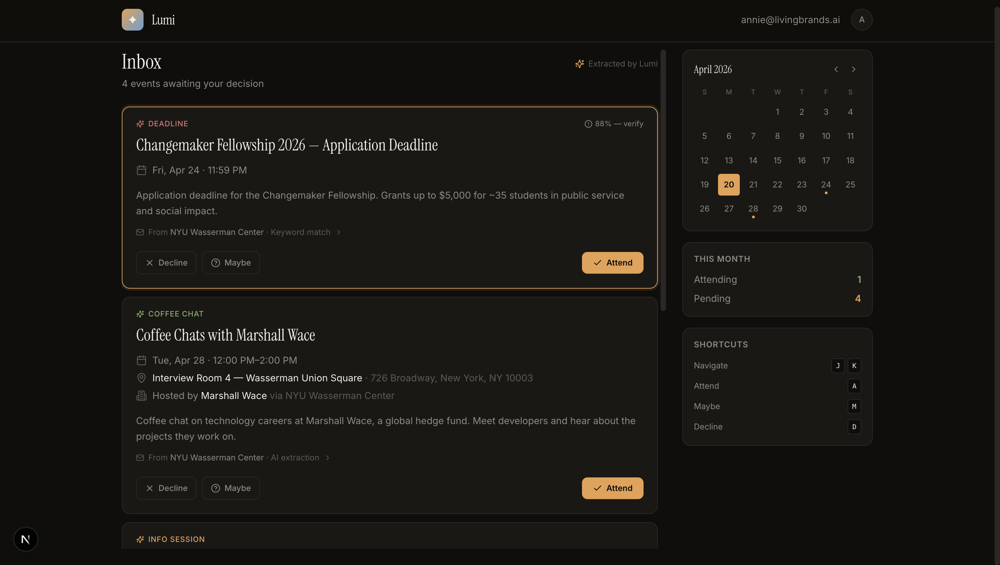

# 📬 Lumi

**AI-powered email-to-calendar assistant.** Lumi scans your inbox, detects event invitations, extracts structured details, and adds them to your calendar with one click.




---

## How It Works

```
Email arrives → Detection → LLM Extraction → Event Card → User decides → Calendar sync
```

1. **Ingestion** — Gmail API push notifications (or IMAP polling) deliver new emails
2. **Detection** — Tiered classifier: ICS attachments → schema.org markup → keyword match → LLM fallback
3. **Extraction** — Claude `tool_use` extracts structured event JSON (title, date, time, location, organizer, attire, RSVP)
4. **Dashboard** — Clean card UI presents events with Attend / Maybe / Decline actions
5. **Calendar** — Accepted events are written to Google Calendar with reminders and conflict detection

## Architecture

```
┌─────────────┐   webhook/poll   ┌──────────────┐
│  Gmail API   │────────────────▸│  Ingestion   │
│  IMAP Server │                  │  Worker      │
└─────────────┘                  └──────┬───────┘
                                        │ enqueue
                                        ▼
                                 ┌──────────────┐
                                 │  Detection   │──▸ ICS? → parse directly
                                 │  Classifier  │──▸ HTML schema? → parse
                                 └──────┬───────┘──▸ ambiguous? → LLM
                                        │
                                        ▼
                                 ┌──────────────┐
                                 │  LLM Extract │  Claude tool_use
                                 │  (if needed) │  structured JSON out
                                 └──────┬───────┘
                                        │
                                        ▼
                                 ┌──────────────┐  ┌─────────────┐
                                 │  Event Store │─▸│  Dashboard  │
                                 │  (Postgres)  │  │  (Next.js)  │
                                 └──────┬───────┘  └──────┬──────┘
                                        │                 │ user action
                                        ▼                 ▼
                                 ┌──────────────┐  ┌─────────────┐
                                 │  Scheduler   │  │  Calendar   │
                                 │  (reminders) │  │  API Write  │
                                 └──────────────┘  └─────────────┘
```

## Tech Stack

| Layer         | Technology                                       |
|---------------|--------------------------------------------------|
| Frontend      | Next.js 15, React 19, Tailwind CSS, Framer Motion |
| Backend       | Next.js API routes, BullMQ (Redis)               |
| Database      | PostgreSQL 16 + Prisma ORM                       |
| Email         | Gmail API + Pub/Sub, IMAP fallback               |
| Calendar      | Google Calendar API                              |
| LLM           | Claude Sonnet via Anthropic API (`tool_use`)     |
| Auth          | NextAuth.js (Google OAuth)                       |
| Validation    | Zod                                              |

## Getting Started

### Prerequisites

- Node.js 20+
- Docker (for local Postgres + Redis) OR your own hosted services
- Google Cloud project with Gmail + Calendar APIs enabled (optional — demo mode works without)
- Anthropic API key (optional — demo mode works without)

### Three modes

Lumi runs in three modes depending on which credentials you've provided:

| Mode           | DB / Redis | Google OAuth | Anthropic | What works                                          |
|----------------|------------|--------------|-----------|-----------------------------------------------------|
| **Demo**       | —          | —            | —         | Full UI against mock data (default, no setup)       |
| **Persisted**  | ✓          | —            | —         | UI writes to real DB; sample data via seed          |
| **Live**       | ✓          | ✓            | ✓         | Gmail ingestion + Claude extraction + Calendar sync |

### 1. Clone & install

```bash
git clone https://github.com/anniehyd/Lumi.git
cd Lumi
npm install
```

### 2. Configure environment

```bash
cp .env.example .env
```

For demo mode, no edits needed. For persisted/live, fill in the relevant keys
(see [Environment Variables](#environment-variables)).

### 3. Start infra (persisted + live modes)

```bash
docker compose up -d        # Postgres on 5432, Redis on 6379
npx prisma migrate dev --name init
npm run db:seed             # loads the NYU Wasserman newsletter demo
```

### 4. Run the app

```bash
npm run dev
```

Open [http://localhost:3000](http://localhost:3000). In demo mode the inbox
populates immediately from mock data; in live mode it populates after the first
Gmail scan.

### 5. Start the worker (live mode)

```bash
npm run worker
```

Handles ingestion jobs and Maybe-reminders from the BullMQ queues.

## Environment Variables

All keys live in `.env.example`. Summary:

| Variable                 | Required for | Notes                                                       |
|--------------------------|--------------|-------------------------------------------------------------|
| `DATABASE_URL`           | Persisted    | Defaults to the Docker Compose Postgres                     |
| `REDIS_URL`              | Worker       | Defaults to the Docker Compose Redis                        |
| `NEXTAUTH_URL`           | Auth         | `http://localhost:3000` locally                             |
| `NEXTAUTH_SECRET`        | Auth         | `openssl rand -base64 32`                                   |
| `GOOGLE_CLIENT_ID/SECRET`| Auth + Gmail + Calendar | Google Cloud Console OAuth app                 |
| `ANTHROPIC_API_KEY`      | Extraction   | `console.anthropic.com`                                     |
| `ANTHROPIC_MODEL`        | —            | Default `claude-sonnet-4-6`                                 |
| `GMAIL_PUBSUB_TOPIC`     | Push ingest  | Optional — falls back to polling                            |
| `GMAIL_WEBHOOK_SECRET`   | Push ingest  | Shared secret Pub/Sub sends as `?token=…`                   |
| `LUMI_USE_MOCK_FALLBACK` | Demo         | `true` (default) falls back to mocks when DB unreachable    |

## API Surface

| Route                            | Purpose                                   |
|----------------------------------|-------------------------------------------|
| `GET  /api/events`               | List events (optional `?status=PENDING`)  |
| `GET/PATCH  /api/events/[id]`    | Single event; PATCH to change status      |
| `GET  /api/events/[id]/ics`      | Download single event as .ics             |
| `POST/DELETE  /api/events/[id]/sync` | Write/remove from Google Calendar     |
| `GET  /api/calendar.ics`         | Subscribable iCal feed (all accepted)     |
| `GET  /api/emails/[id]`          | Single email (source of an event)         |
| `GET  /api/sync/status`          | Ingest health + DB connectivity           |
| `POST /api/ingest/poll`          | Manual Gmail scan (authed user)           |
| `POST /api/ingest/webhook`       | Gmail Pub/Sub push handler                |

## Project Structure

```
lumi/
├── prisma/
│   └── schema.prisma          # Database schema
├── src/
│   ├── app/
│   │   ├── api/
│   │   │   ├── events/        # Event CRUD endpoints
│   │   │   ├── webhooks/gmail/ # Gmail push notification receiver
│   │   │   └── cron/reminders/ # Maybe-event reminder scheduler
│   │   ├── dashboard/         # Main dashboard page
│   │   ├── layout.tsx         # Root layout with auth provider
│   │   └── page.tsx           # Landing / auth gate
│   ├── components/
│   │   ├── EventCard.tsx      # Interactive event card
│   │   ├── EventFeed.tsx      # Scrollable event list
│   │   ├── DetailPanel.tsx    # Expanded event detail
│   │   └── MiniCalendar.tsx   # Sidebar calendar widget
│   └── lib/
│       ├── services/
│       │   ├── email.ts       # Gmail API + IMAP ingestion
│       │   ├── detector.ts    # Event detection pipeline
│       │   ├── extractor.ts   # Claude LLM extraction
│       │   ├── calendar.ts    # Google Calendar write
│       │   └── scheduler.ts   # BullMQ reminder jobs
│       ├── schemas/
│       │   └── event.ts       # Zod schemas + types
│       └── utils/
│           ├── ics-parser.ts  # ICS/iCal parsing
│           └── dedup.ts       # Email deduplication
├── scripts/
│   └── seed-test-emails.ts    # Dev seed script
├── .env.example
├── .github/workflows/ci.yml
├── next.config.ts
├── tailwind.config.ts
├── tsconfig.json
├── package.json
└── README.md
```

## MVP Phases

| Phase | Scope                | Timeline  |
|-------|----------------------|-----------|
| 1     | Email parsing        | Week 1–2  |
| 2     | Event extraction     | Week 3–4  |
| 3     | UI dashboard         | Week 5–6  |
| 4     | Calendar automation  | Week 7–8  |

See the interactive [Product Design Spec](src/app/dashboard/design-spec.tsx) for full details on architecture, schemas, edge cases, and tech decisions.

## License

MIT — see [LICENSE](LICENSE).
